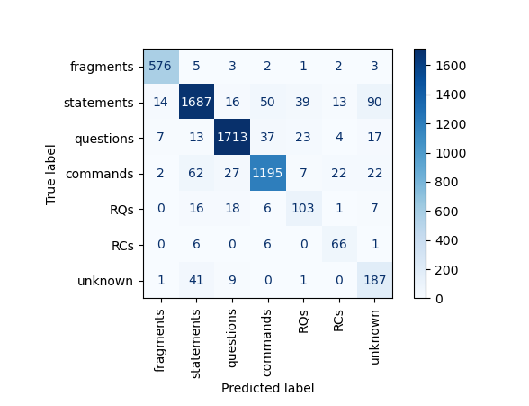
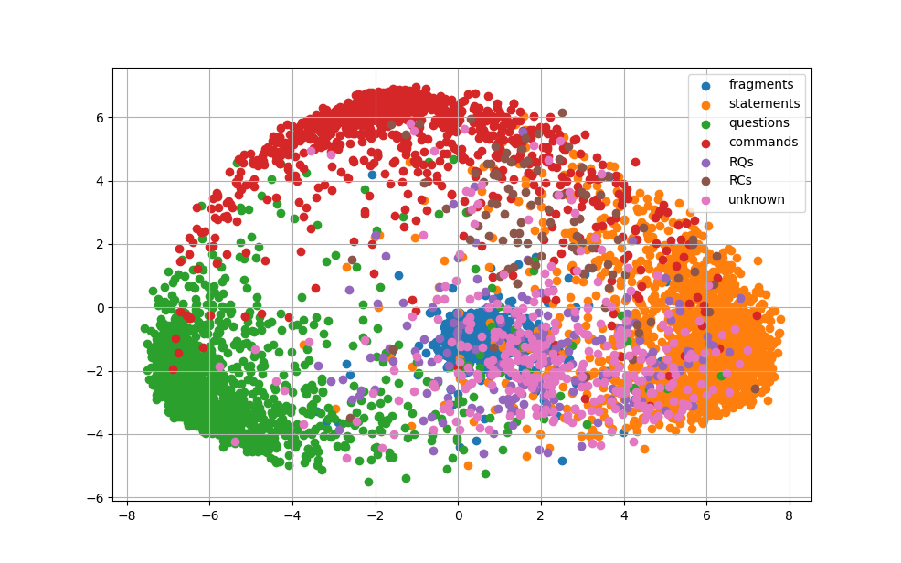

# Korean_intetion_classifier
## Trainset: 3i4k dataset
## Result

* RQ: Rhetorical question
* RC: Rhetorical command
* class 마다 절대적인 샘플 수가 다르기 때문에 색의 진하기가 균일하지 못하다. 
* 그러나 Rhetorical question을 제외하면 모든 카테고리에 대해 reasonable한 분류 성능을 낸다..

* 2D visualization of 6121 test samples 

* 결과 분석
    * Accuracy: 90.30 %
    * Distribution
        -	Question, command, statement가 선명하게 구분된다. 
        -	Rhetorical question은 statement와 question 사이에 분포해 있다.
        -   Rhetorical command는 command와 statement 사이에 분포해 있다.
        -	Fragments와 unknown은 구분은 가능하나, 이웃하게 분포해 있다. 