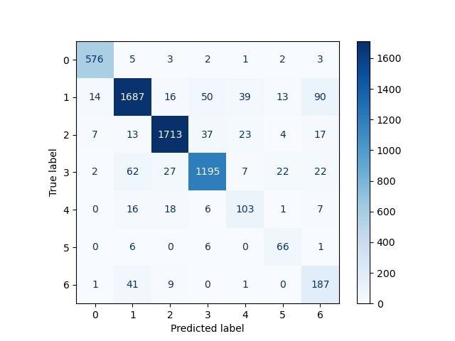

# DistilBert_intetion_classifier
## Trainset: 3i4k dataset
## Result
* Confusion matrix

* Classification visualization of 6000 < samples

* 결과 분석
    * Distribution
        -	Question, command, statement가 선명하게 구분된다. 
        -	Rhetoricla question은 statement와 question 사이에 분포해 있다.
        -	Fragments와 unknown은 구분은 가능하나, 이웃하게 분포해 있다. 
    * Confusion matrix   
        -	scikitlearn.metrics를 사용해 confusion matrix를 만들고 그림
        -	class 마다 절대적인 샘플 수가 다른 것을 고려하여 ‘all’ 옵션으로 normalize하려고 했으나 기대했던 효과를 얻지 못함. 다른 어떤 옵션으로 normalize해도 기대했던 효과를 얻지 못함.
        -	Attention matrix는 올라가는 대각선으로 그리는 게 convention이지만 confusion matrix는 내려가는 대각선으로 그리는 게 convention 인 듯 하다.

